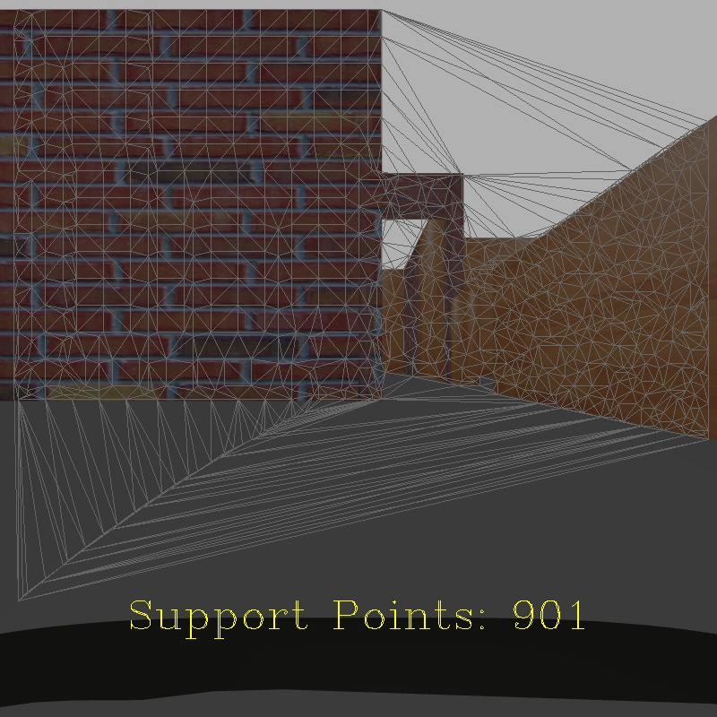

# Stereo Matching算法嵌入Octopus环境

## gazebo相机配置文件

双目相机的配置文件在原先kinect相机的基础上修改得来.路径为Sineva_Octopus/octopus/dashgo/dashgo_description/urdf/sensors/stereo_gazebo.urdf.xacro

在双目参考帧相机(左相机)相同位置处加入一个深度相机模型,相机噪声设置为零,使用该RGBD相机产生的深度图作为深度真值图.在双目相机和RGBD相机描述文件下分别插入插件,发布左右目的彩色图像和参考帧画面对应的深度图. 加载相机后,以下发布的Topic可作为ELAS算法的输入:
深度图:  "/camera/depth/image_raw"

左目图像:  "/multisense_sl/camera/left/image_raw"

右目图像: "/multisense_sl/camera/right/image_raw"

深度相机彩色图像:   "/camera/rgb/image_raw"

其中,深度相机的彩色图像与左目相机的图像是同一副图像,用来验证深度真值图和左右目图像的对应性.

## ELAS算法节点

在/octopus_simulations中加入立体视觉的包:octopus_stereo_matching,回到工作空间,对ELAS节点和深度相机插件进行编译:

```
cd ~/catkin_ws
```

```
catkin_make
```

```
source devel/setup.bash
```

该节点的功能是:

1. 接收左右目图像,运行ELAS算法计算深度图,将深度图发布; 
2. 接收深度真值图,与左右目图像同步,与计算得出的深度图同步保存;
3. 将计算过程中的德洛内三角形画出并发布和保存,保存图像中支撑点(Support Points)的数量信息

运行Octopus后,打开新的terminal,运行如下命令启动ELAS节点

```
rosrun sineva_stereo sineva_stereo_node
```

数据保存的路径为/home/{user name}/Images_Results/.其中DelaunayImage文件夹为保存的德洛内三角形图像;DelthImage_GT文件夹为深度真值数据,格式csv;文件夹DepthImage_CL为计算出的深度数据,格式csv



```

```

## 数据后处理

保存数据后,在/home/colin/catkin_ws/src/Sineva_Octopus/octopus_simulations/octopus_postprocessing/scripts/Stereo_Evaluation路径下运行Elas_Eval.m程序,可得后处理结果results.csv